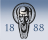
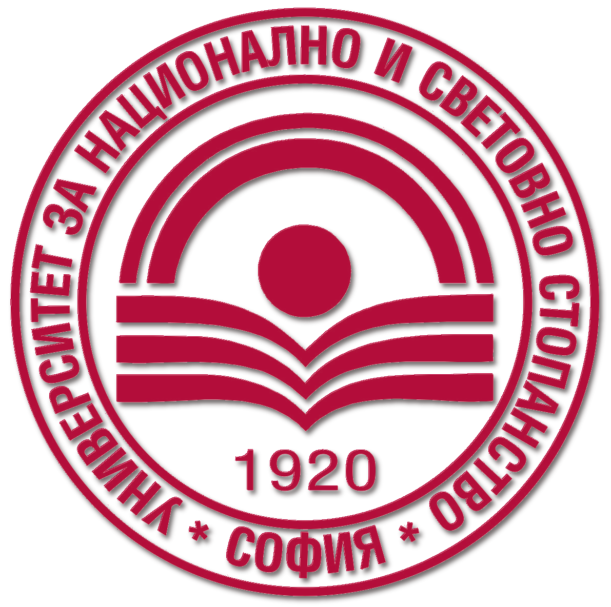
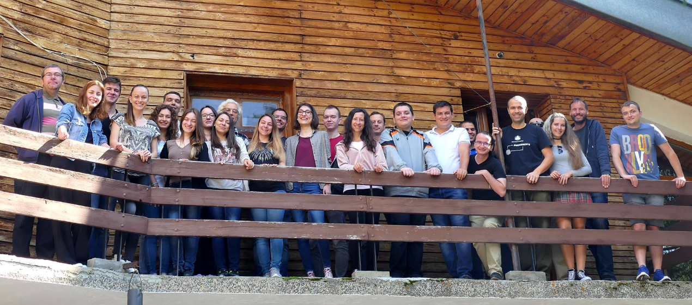
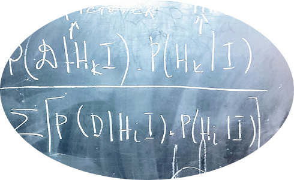
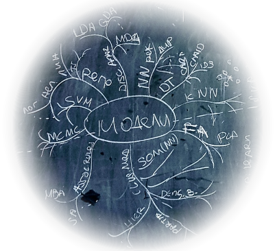
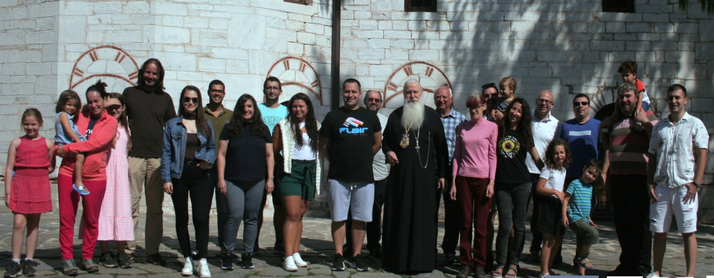

# Summer School on Modeling and Complex Systems '2023

**Organized by**

<table cellspacing="0" cellpadding="0" border="0">
  <tr>
    <th></th>
    <th></th>
    <th></th>
   </tr>
  <tr>
    <td>FEBA Faculty of Economics and Business Administration <a href="https://feba.uni-sofia.bg/">https://feba.uni-sofia.bg/</a></td>
    <td>FDIBA German Engineering and Industrial Management Faculty <a href="https://fdiba.tu-sofia.bg/">https://fdiba.tu-sofia.bg/</a></td>
    <td>University for National and World Economy <a href="https://unwe.bg">https://unwe.bg</a></td>
  </tr>
 </table>

**Partners**

<table cellspacing="0" cellpadding="0" border="0">
  <tr>
    <th></th>
    <th></th>
  </tr>
  <tr>
    <td>KBC Bank</td>
    <td>Contact us for inquieries</td>
  </tr>
 </table>

<!--  
Associate Partners
<table cellspacing="0" cellpadding="0" border="0">
  <tr>
    <th></th>
  </tr>
  <tr>
    <td>The Edge <a href="https://theedge.solutions/">https://theedge.solutions/</a></td>
  </tr>
 </table>

-->
  
## Application  
 
**Location**: [Educational and sports rehabilitation base Semkovo](https://usob.tu-sofia.bg/index.php/semkovo), Rila Mountain, Bulgaria  
  
**Time**: July 14 - July 23, 2023   
  
**Target audience**: PhD students in their first 18 months and advanced graduates (master students).   
  
**Official language**: For written materials - Bulgarian or English, for lectures - Bulgarian.  
  
**Application**: <!--**EXTENDED**--> Deadline for student application is June 20, 2023 by filling-in this application form: [https://forms.gle/r1RAMQjYJqWaWDib9](https://forms.gle/r1RAMQjYJqWaWDib9).    
Only some applications would be approved, who will be notified by e-mail on June 26 and will recieve further instructions.    
Participation in the Summer school is free of charge.  

## Main objectives  
* Creating an attitude for studying and applying scientific methods in research.  
* Winning the hearts and minds of learners to apply the scientific method.  
* Permanent change of students' attitudes.  
* Upgrading the knowledge and skills for scientific work  
  
**Concept**: Intensive training in methods (not so much applications) through lectures, workshops and team work on projects.  
  
## Accomodation  
**Travel**: The trip is up to the participants to organize on their own (while some coordination effort will be done for optimizing the travel organization. Everyone should arrive by **18:30, on 14 July, Friday**, at the main entrance of the complex.    
  
**Accommodation**: The students are accommodated in pairs / threes / fours in a room in the complex. Accomodation and full meals cost BGN 60 per person per night. Out of which **20% is covered by the organizers**. The layout of the rooms will be set by the organizers and can not be changed.   
  
**Daily schedule**:  
08:00 - 09:00 Breakfast  
09:30 - 13:00 Lectures in the classroom   
13:00 - 14:00 Lunch  
14:00 - 17:00 Workshops in the classroom   
After 17:00 working on team assignment"   
19:00 Dinner   
"The classroom could be used untill late, but no loud noises permitted.  

**Acknowledgement**: This Summer school is partially funded by ***Science and research Fund at Sofia University***.  

## Certification  
**Cases**: As part of the Summer school the participants would have to solve and present a case, out of several options, which will be given on the first day. [See information about the cases here...](cases.md)-->  
  
**Certification**: Certificates issued by Faculty of Economics and Business Administration will be issued to those who successfully pass the Summer school in a special cerempny after the end of the Summer school. The requirements are:  
1) at least 70% active participation in the classes  
2) participation in a team with a presented solution of case at the end  
3) Presented paper at a conference or seminar, showcasing knowledge and skills educated throughout the Summer school.  
Note: Participants who cannot take part fulltime and/or would not comply with the requirements can also join classes, but will not receive a certificate.  
  
## Technical requirements  
Apart from concentrating during the classes, the aproved participants should make sure to be equipped with a **personal computer (not mobile device)** installed with:  

* Python 3.9 or higher [https://www.anaconda.com/products/individual](https://www.anaconda.com/download/)  
* Jupyter Notebook [https://www.anaconda.com/products/individual](https://www.anaconda.com/download/)  
<!--* spyder [https://www.anaconda.com/products/individual](https://www.anaconda.com/download/)-->  
* R [https://cran.r-project.org/bin/windows/base/](https://cran.r-project.org/bin/windows/base/)  
* R Studio [https://www.rstudio.com/products/rstudio/download/#download](https://www.rstudio.com/products/rstudio/download/#download)  
* Orange [https://orange.biolab.si/download/](https://orange.biolab.si/download/)  
<!--* KNIME [https://www.knime.com/downloads](https://www.knime.com/downloads)-->  
* Registration in Github [https://github.com](https://github.com)  
<!--* Zoom [https://zoom.com](https://zoom.com) with installed personal photo-->  

## Contacts  
**Facebook group**: [https://www.facebook.com/groups/223483361788013/](https://www.facebook.com/groups/223483361788013/)  

**Organizer**: Faculty of Economics and Business administration, Sofia University. In partnership with Faculty of German Engineering Education and Industrial Management, Technical University - Sofia, University of National and World Econmy. For questions: angel.marchev@feb.uni-sofia.bg  

  

**Lecturers**:  
* Angel Marchev Jr. (angel.marchev@feb.uni-sofia.bg)  
* Angel Marchev Sr. (angel_marchev@yahoo.co.uk)  
* Alexander Efremov (aefremov@gmail.com)  
* Kaloyan Haralampiev (k_haralampiev@hotmail.com)  
* Mihail Motzev (Mihail.Motzev@wallawalla.edu)
* Martin Minchev (mjminchev@fmi.uni-sofia.bg)     
* Pavel Nikolov (pavelnnikolov@gmail.com)  
* Petar Nikolov (petarnikolov1989@gmail.com)  
* Stanimir Kabaivanov (stanimir.kabaivanov@gmail.com)  
* Boris Kirov (boris.kirov@tu-sofia.bg)  
* Sergey Vichev (serjvichev@gmail.com)
* Deyan Radev (d.radev@feb.uni-sofia.bg)  
  
  
**Archives**:  
PhD Workshop (as part of VSIM conference)  
[ [2015](https://vsim-conf.info/2015/en) ]
[ [2016](https://vsim-conf.info/2016/en) ]
[ [2017](https://vsim-conf.info/2017/en) ]  
Summer School on Research Methods  
[ [2018](https://drive.google.com/drive/folders/1Jqx1GELDcEky8sj1hPzSyBJeUT8zcJOj) ]
[ [2019](https://drive.google.com/drive/folders/12N3q7BOulhvLZmIAcfSnvkhLvSVAY9SO) ]
[ [2020](https://marchev-science.github.io/Summer-school-on-research-methods-2020/) ]  
Summer School on Modeling and Complex Systems  
[ [2021](https://marchev-science.github.io/summer-school-2021/) ]
[ [2022](https://marchev-science.github.io/summer-school-2022/) ]  

## Cases  
The cases for this year's Summer school are [revieled here...](cases.md) at the start of the Summer school. 

## Programme  
(subject to change)  
  
**2023-07-14 Openning**  
before 18:30 Accomodation   
18:30 - 19:30 Organizational issues  
19:30 - 21:00 Networking exercise  
  
**2023-07-15 Fundamentals**  
09:30 - 13:00 Opening session: Angel Marchev, Sr. - The scientific method & General Systems Theory: a systematic approach to research   
14:00 - 17:00 Workshop: Angel Marchev, Jr. - Introduction to software environments for modeling   
17:00 - 19:30 Workshop: Explaining the cases    
  
**2023-07-16 Fundamentals**  
09:30 - 13:00 Angel Marchev, Sr. - Cybernetics studying complex systems with feedback  
14:00 - 17:00 Workshop: Boris Kirov - Introduction to Prompt engineering for Data analysis   
17:00 - 19:30 Workshop: Teamwork on case assignments  
  
**2023-07-17 Fundamentals**  
09:30 - 10:30 Martin Minchev - Introduction to probability   
11:00 - 13:00 Kaloyan Haralampiev - Bayesian paradigm    
14:00 - 17:00 Workshop: Data synthesis / feature engineering - Angel Marchev, Jr.   
17:00 - 19:30 Workshop: Teamwork on case assignments  
  
**2023-07-18 Fundamentals**  
09:30 - 13:00 Alexander Efremov, Kaloyan Haralampiev - Data mining: methods & main tasks    
14:00 - 17:00 Workshop: Kaloyan Haralampiev - Introduction to Orange   
17:00 - 19:30 Workshop: Teamwork on case assignments  
  
**2023-07-19 Machine Learning concepts**  
09:30 - 11:00 Alexander Efremov - Introduction to numerical optimization   
11:30 - 13:00 Alexander Efremov - Approaches for variable selection   
14:00 - 17:00 Workshop: Deyan Radev - Regression Analysis in R (Online)      
17:30 - 19:30 Workshop: Teamwork on case assignments  

**2023-07-20 Time series**  
09:30 - 13:00 TBD - Time series basics   
14:00 - 17:00 Peter Nikolov - TBD    
17:30 - 19:30 Workshop: Teamwork on case assignments  
  
**2023-07-21 Artificial Neural Networks**  
09:30 - 11:00 Mihail Motzev - Statistical Learning Networks   
11:30 - 13:00 TBD   
14:00 - 17:00 Workshop: Stanimir Kabaivanov - Introduction to Artificial Neural Networks   
16:00 - 19:30 Workshop: Teamwork on case assignments  
  
**2023-07-22 Self-organmization & adaptation**  
09:30 - 13:00 Angel Marchev, Sr., Angel Marchev, Jr. - Multi-stage selection procedure and Self-organization   
14:00 - 17:00 Pavel Nikolov - Evolutionary alghorithm for hyperparameter optimization    
17:00 - 19:30 Workshop: Teamwork on case assignments    
  
**2023-07-23 Perspectives**  
09:30 - 10:30 Sergey Vichev - Automation and fine-tunning of a LLM for data science  
10:30 - 11:30 Boyan Markov - Empirical approach of studying individual risk preference  
12:00 - 13:00 A word from our partners       
14:00 - 17:00 Conference - presentation of the solutions to the case assignments   
17:00 - 17:30 Closing ceremony  
