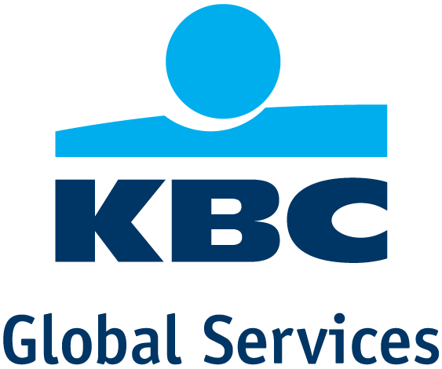
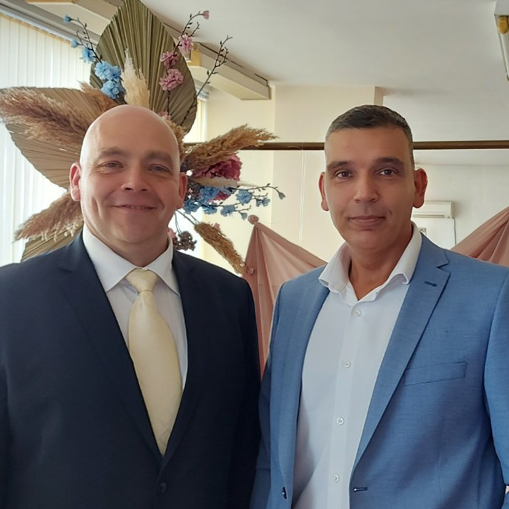
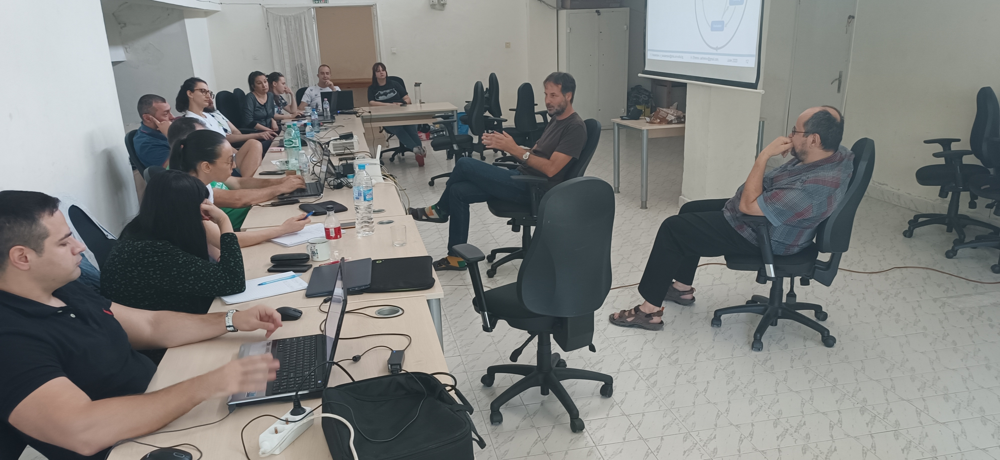

# Summer School on Modeling and Complex Systems '2023

**Organized by**

<table cellspacing="0" cellpadding="0" border="0">
  <tr>
    <th></th>
    <th></th>
    <th></th>
   </tr>
  <tr>
    <td>FEBA Faculty of Economics and Business Administration <a href="https://feba.uni-sofia.bg/">https://feba.uni-sofia.bg/</a></td>
    <td>FDIBA German Engineering and Industrial Management Faculty <a href="https://fdiba.tu-sofia.bg/">https://fdiba.tu-sofia.bg/</a></td>
    <td>University for National and World Economy <a href="https://unwe.bg">https://unwe.bg</a></td>
  </tr>
 </table>

**Partners**

<table cellspacing="0" cellpadding="0" border="0">
  <tr>
    <th></th>
    <th></th>
  </tr>
  <tr>
    <td>KBC Bank</td>
    <td>Svetoslav & Emanuil Manasievi</td>
  </tr>
 </table>

<!--  
Associate Partners
<table cellspacing="0" cellpadding="0" border="0">
  <tr>
    <th></th>
  </tr>
  <tr>
    <td>The Edge <a href="https://theedge.solutions/">https://theedge.solutions/</a></td>
  </tr>
 </table>

-->
  
## Application  
 
**Location**: [Educational and sports rehabilitation base Semkovo](https://usob.tu-sofia.bg/index.php/semkovo), Rila Mountain, Bulgaria  
  
**Time**: July 14 - July 23, 2023   
  
**Target audience**: PhD students in their first 18 months and advanced graduates (master students).   
  
**Official language**: For written materials - Bulgarian or English, for lectures - Bulgarian.  
  
**Application**: <!--**EXTENDED**--> Deadline for student application is June 20, 2023 by filling-in this application form: [https://forms.gle/r1RAMQjYJqWaWDib9](https://forms.gle/r1RAMQjYJqWaWDib9).    
Only some applications would be approved, who will be notified by e-mail on June 26 and will recieve further instructions.    
Participation in the Summer school is free of charge.  

## Main objectives  
* Creating an attitude for studying and applying scientific methods in research.  
* Winning the hearts and minds of learners to apply the scientific method.  
* Permanent change of students' attitudes.  
* Upgrading the knowledge and skills for scientific work  
  
**Concept**: Intensive training in methods (not so much applications) through lectures, workshops and team work on projects.  
  
## Accomodation  
**Travel**: The trip is up to the participants to organize on their own (while some coordination effort will be done for optimizing the travel organization. Everyone should arrive by **18:30, on 14 July, Friday**, at the main entrance of the complex.    
  
**Accommodation**: The students are accommodated in pairs / threes / fours in a room in the complex. Accomodation and full meals cost BGN 60 per person per night. Out of which **20% is covered by the organizers**. The layout of the rooms will be set by the organizers and can not be changed.   
  
**Daily schedule**:  
08:00 - 09:00 Breakfast  
09:30 - 13:00 Lectures in the classroom   
13:00 - 14:00 Lunch  
14:00 - 17:00 Workshops in the classroom   
After 17:00 working on team assignment"   
19:00 Dinner   
"The classroom could be used untill late, but no loud noises permitted.  

**Acknowledgement**: This Summer school is partially funded by ***Science and research Fund at Sofia University, contract 80-10-186/17.05.2023***.  

## Certification  
**Cases**: As part of the Summer school the participants would have to solve and present a case, out of several options, which will be given on the first day. [See information about the cases here...](cases.md)-->  
  
**Certification**: Certificates issued by Faculty of Economics and Business Administration will be issued to those who successfully pass the Summer school in a special cerempny after the end of the Summer school. The requirements are:  
1) at least 70% active participation in the classes  
2) participation in a team with a presented solution of case at the end  
3) Presented paper at a conference or seminar, showcasing knowledge and skills educated throughout the Summer school.  
Note: Participants who cannot take part fulltime and/or would not comply with the requirements can also join classes, but will not receive a certificate.  
  
  
  
## Technical requirements  
Apart from concentrating during the classes, the aproved participants should make sure to be equipped with a **personal computer (not mobile device)** installed with (all these have compatible versions for any operation system):  

* Python 3.9 or higher [https://www.anaconda.com/products/individual](https://www.anaconda.com/download/)  
* Jupyter Notebook [https://www.anaconda.com/products/individual](https://www.anaconda.com/download/)  
<!--* spyder [https://www.anaconda.com/products/individual](https://www.anaconda.com/download/)-->  
* R [https://cran.r-project.org/bin/windows/base/](https://cran.r-project.org/bin/windows/base/)  
* R Studio [https://www.rstudio.com/products/rstudio/download/#download](https://www.rstudio.com/products/rstudio/download/#download)  
* Orange [https://orange.biolab.si/download/](https://orange.biolab.si/download/)  
<!--* KNIME [https://www.knime.com/downloads](https://www.knime.com/downloads)-->  
* Registration in Github [https://github.com](https://github.com)
* Registration in ChatGPT [https://chat.openai.com](https://chat.openai.com)
<!--* Zoom [https://zoom.com](https://zoom.com) with installed personal photo-->  

## Preliminary readings  
All students should make sure to prepare [these materials in advance...](https://www.youtube.com/playlist?list=PLX9ryRl9v7BDarUc8m0E37Uv5e64w8FtA)   

## Contacts  
**Facebook group**: [https://www.facebook.com/groups/223483361788013/](https://www.facebook.com/groups/223483361788013/)  

**Zoom class**: [http://bit.ly/marchev-zoom](http://bit.ly/marchev-class)

**Organizer**: Faculty of Economics and Business administration, Sofia University. In partnership with Faculty of German Engineering Education and Industrial Management, Technical University - Sofia, and University of National and World Econmy. For questions: angel.marchev@feb.uni-sofia.bg, +359888444062  

  

**Lecturers**:  
* Alexander Efremov (aefremov@gmail.com)  
* Angel Marchev Jr. (angel.marchev@feb.uni-sofia.bg)  
* Angel Marchev Sr. (angel_marchev@yahoo.co.uk)
* Bogomil Filipov (filipov.bogomil@gmail.com)   
* Boris Kirov (boris.kirov@tu-sofia.bg)  
* Boyan Markov (boyanmarkov@gmail.com)   
* Demir Tonchev (tonchev.demir@gmail.com)   
* Deyan Radev (d.radev@feb.uni-sofia.bg)
* Irem Yaman (irem.yaman2@kbc.com)   
* Kaloyan Haralampiev (k_haralampiev@hotmail.com)  
* Martin Minchev (mjminchev@fmi.uni-sofia.bg)     
* Mihail Motzev (Mihail.Motzev@wallawalla.edu)
* Pavel Nikolov (pavelnnikolov@gmail.com)  
* Petar Nikolov (petarnikolov1989@gmail.com)  
* Sergey Vichev (serjvichev@gmail.com)   
* Stanimir Kabaivanov (stanimir.kabaivanov@gmail.com)  

  
**Archives**:  
PhD Workshop (as part of VSIM conference)  
[ [2015](https://vsim-conf.info/2015/en) ]
[ [2016](https://vsim-conf.info/2016/en) ]
[ [2017](https://vsim-conf.info/2017/en) ]  
Summer School on Research Methods  
[ [2018](https://drive.google.com/drive/folders/1Jqx1GELDcEky8sj1hPzSyBJeUT8zcJOj) ]
[ [2019](https://drive.google.com/drive/folders/12N3q7BOulhvLZmIAcfSnvkhLvSVAY9SO) ]
[ [2020](https://marchev-science.github.io/Summer-school-on-research-methods-2020/) ]  
Summer School on Modeling and Complex Systems  
[ [2021](https://marchev-science.github.io/summer-school-2021/) ]
[ [2022](https://marchev-science.github.io/summer-school-2022/) ]  

## Cases  
The cases for this year's Summer school are [revieled here...](cases.md) at the start of the Summer school. 

## Programme  
The programme is subject to constant change, so make sure to check it regularly. The programme is available [here...](programme.md) All supporting materials and recorded videos are linked in the classes. 
